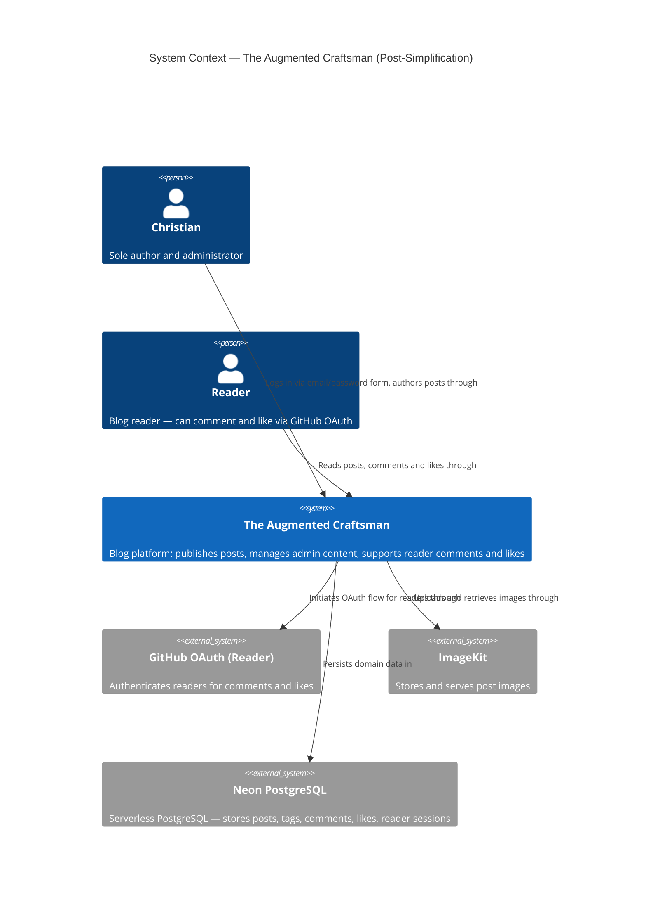
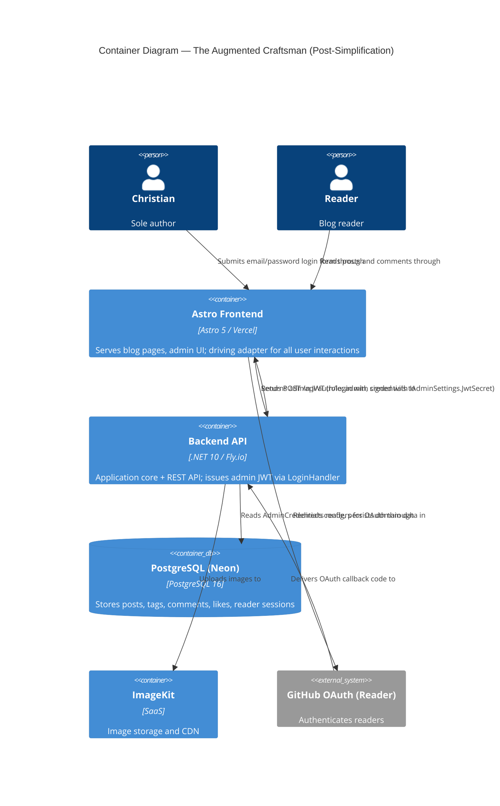

# Architecture Design: Admin Auth Simplification

**Feature ID**: admin-auth-simplification
**Wave**: DESIGN
**Date**: 2026-03-15
**Author**: Morgan (nw-solution-architect)
**Status**: Approved — ready for DISTILL wave

---

## 1. Problem Statement

The admin authentication system accumulated accidental complexity during the author-mode build: a 4-step OAuth flow involving two GitHub OAuth apps, a Redis-backed nonce store, three use cases, and keyed DI registrations. A `LoginHandler` already exists with bcrypt verification, brute-force protection, and JWT emission — but it emitted a token signed with the wrong secret and carrying no `role: "admin"` claim, making it unusable for admin access.

This design describes the minimal changes to close the JWT gap, remove all OAuth admin artifacts, and leave a simpler, fully testable auth surface.

---

## 2. Architecture Context

The system is a brownfield modular monolith following Hexagonal Architecture + Vertical Slice. No structural change to the architecture is made by this feature. The changes are:

- One existing use case (`LoginHandler`) is modified
- One port (`IAdminSettings`) is narrowed
- One port (`ITokenGenerator`), its implementation (`JwtTokenGenerator`), and two more ports/implementations (`IAdminTokenStore`, `InMemoryAdminTokenStore`, `RedisAdminTokenStore`) are deleted
- Three OAuth use cases and their endpoint file are deleted
- One frontend page is replaced; one is deleted

This is a **deletion-dominant refactor** inside an existing architecture.

---

## 3. C4 System Context Diagram (L1)



**Notable change from prior state**: The second GitHub OAuth app (admin OAuth) and Redis are no longer external dependencies for admin authentication. Redis remains absent for admin auth after this change.

---

## 4. C4 Container Diagram (L2)



---

## 5. Auth Flow: Before and After

### Before (OAuth — 4 steps, 2 external dependencies)

```
Christian → /admin/login (OAuth button)
         → GET /api/auth/admin/oauth/google (InitiateAdminOAuth)
         → GitHub/Google OAuth Provider
         → GET /api/auth/admin/oauth/google/callback (HandleAdminOAuthCallback)
              → Email whitelist check (IAdminSettings.AdminEmail)
              → Single-use nonce stored in Redis (IAdminTokenStore)
              → Redirect to /admin/oauth/callback?token=<nonce>
         → POST /api/auth/admin/verify-token (VerifyAdminToken)
              → Consume nonce from Redis
              → Issue admin JWT (role: admin, IAdminSettings.JwtSecret)
         → Admin session active
```

### After (Email/Password — 1 step, 0 external dependencies)

```
Christian → /admin/login (email/password form)
         → POST /api/auth/login (LoginHandler)
              → FailureTracker lockout check
              → bcrypt verify against AdminCredentials
              → Issue admin JWT (role: admin, IAdminSettings.JwtSecret, 480 min)
         → Admin session active (JWT stored in browser)
```

---

## 6. JWT Transport Decision

**Decision**: The admin JWT is returned in the `POST /api/auth/login` response body as `{ "token": "...", "expiresAt": "..." }`. The frontend stores it in memory and attaches it as a Bearer token on subsequent admin API requests.

**Rationale**:
- The frontend is Astro with `prerender = false` for admin pages — it is a SPA-adjacent SSR page, not a pure static site. Inline script is available.
- httpOnly cookies require CORS `credentials: include` and cookie domain alignment between Vercel and Fly.io. The existing `AllowCredentials()` CORS policy already handles this, but frontend-side cookie read (for expiry display) is blocked by httpOnly.
- The existing `LoginResponse` record already returns `token` + `expiresAt` in the response body — no API contract change is needed.
- The admin login page is behind HTTPS on a known domain. The threat model (solo author, personal device) does not require the additional complexity of httpOnly cookies.
- If XSS risk increases (third-party scripts), this can be revisited. See ADR-005.

**Lockout state communication**: HTTP 429 with JSON body `{ "error": "Too many attempts. Try again in 15 minutes." }`. The frontend reads the status code to distinguish lockout (429) from wrong credentials (401) and render the appropriate message. This is already implemented in `AuthEndpoints.cs` — no change required.

**Frontend form submit mechanism**: JavaScript `fetch` (not native HTML form action). Rationale: loading state (disabled button within 100ms of click, AC-02-5) requires JS. The Astro page has `prerender = false` so inline `<script>` is available. Native form action would cause a full page navigation, preventing inline error display (AC-02-6).

---

## 7. Component Interaction Diagram

The following shows the post-simplification interactions within the Application layer for the admin login path:

```
POST /api/auth/login
        │
        ▼
AuthEndpoints.LoginAsync          [Api — driving adapter]
        │  LoginCommand(email, password)
        ▼
LoginHandler.HandleAsync          [Application — use case]
        │  FailureTracker.IsLockedOut(now)
        │  IPasswordHasher.Verify(password, hash)   ← driven port (IPasswordHasher)
        │  [JWT issuance inlined here]
        │  IAdminSettings.JwtSecret                 ← driven port (IAdminSettings)
        │  IClock.UtcNow                             ← driven port (IClock)
        ▼
LoginResult.Success(token, expiresAt)
        │
        ▼
AuthEndpoints → Results.Ok(LoginResponse(token, expiresAt))
```

**Deleted interaction path (OAuth)**:
- `InitiateAdminOAuth` → `IOAuthClient("admin")` → provider redirect
- `HandleAdminOAuthCallback` → `IOAuthClient("admin")` + `IAdminTokenStore.StoreAsync`
- `VerifyAdminToken` → `IAdminTokenStore.ConsumeAsync` → JWT issuance

---

## 8. Error Response Contract

| Scenario | HTTP Status | Response Body |
|---|---|---|
| Correct credentials | 200 OK | `{ "token": "...", "expiresAt": "2026-03-15T17:00:00Z" }` |
| Wrong credentials (< 5 failures) | 401 Unauthorized | `{ "error": "Invalid email or password" }` |
| 4th failure warning | 401 Unauthorized | `{ "error": "Invalid email or password" }` + frontend counts locally |
| Locked out (>= 5 failures) | 429 Too Many Requests | `{ "error": "Too many attempts. Try again in 15 minutes." }` |
| JWT expired on admin endpoint | 401 Unauthorized | Standard ASP.NET JWT bearer 401 |

**Note on 4th failure warning (AC-03-1)**: The backend does not expose remaining-attempt count. The frontend must track the count locally from 401 responses during the current session. On first 401, frontend shows generic message. On 4th 401 in session (before 429), frontend shows "1 attempt remaining" warning. This is a purely frontend state machine — the backend API contract does not change for this feature.

This decision keeps the API lean and avoids exposing attempt count (which could be used to probe the account state). Consistent with BR-6 (no enumeration).

---

## 9. Quality Attribute Scenarios

### Maintainability
- 8 files deleted, ~350-400 LOC removed. Auth surface shrinks from 3 use cases + 2 ports + 2 adapters + 4 endpoints to 1 use case + 1 port.
- `LoginHandler` becomes self-contained: no external JWT delegation.
- `IAdminSettings` with 1 property (`JwtSecret`) remains a valid hexagonal port. A 1-property interface that enforces the dependency-inversion rule is not over-engineering.

### Testability
- `LoginHandler` unit tests require: `AdminCredentials` (record), `IPasswordHasher` (mockable), `IAdminSettings` (mockable — 1 property), `IClock` (mockable). No Redis, no `ITokenGenerator`.
- Acceptance tests: `"Christian is authenticated"` step POSTs to `/api/auth/login` with test credentials from `WebApplicationFactory` config. No OAuth stub required.
- `WebApplicationFactory` simplification removes the `IAdminTokenStore` override and keyed `IOAuthClient("admin")` — two fewer override points, fewer DI registration conflicts.

### Security
- Admin JWT signed with `IAdminSettings.JwtSecret` (separate from reader `JwtSettings.Secret`) — token domain isolation preserved (BR-2).
- `POST /api/auth/login` already validates over HTTPS. Credentials never logged.
- Brute-force protection (`FailureTracker`) unchanged.
- JWT lifetime: 480 minutes hardcoded (BR-3).
- Error messages remain generic — no enumeration (BR-6).

### Reliability
- Dependency on Redis eliminated for admin auth. Admin login no longer fails when Redis is unavailable.
- `FailureTracker` in-memory — acceptable for single-instance Fly.io. Multi-instance risk documented in ADR-006.

---

## 10. Deployment Impact

### Environment Variables — Removed

| Variable | Used by |
|---|---|
| `OAuth:Admin:GitHub:ClientId` | `Program.cs` keyed IOAuthClient registration |
| `OAuth:Admin:GitHub:ClientSecret` | `Program.cs` keyed IOAuthClient registration |
| `Redis:Host` | `Program.cs` — only needed for admin token store |
| `Redis:Password` | `Program.cs` — only needed for admin token store |
| `Admin:Email` | `IAdminSettings.AdminEmail` (removed from interface) |

### Environment Variables — Retained

| Variable | Used by |
|---|---|
| `Admin:JwtSecret` | `IAdminSettings.JwtSecret` — signing admin JWTs |
| `AdminCredentials:Email` | `AdminCredentials` — credential validation |
| `AdminCredentials:HashedPassword` | `AdminCredentials` — bcrypt verify |
| `Jwt:Secret` | `JwtSettings` — reader JWT signing (unchanged) |

**Note**: After removing `Admin:Email` from `IAdminSettings`, the admin email lives exclusively in `AdminCredentials:Email`. `Program.cs` must be updated to remove the `Admin:Email` config read from the `IAdminSettings` factory registration.

### Redis Removal

After this feature, `StackExchange.Redis` is no longer required as a runtime dependency for admin auth. The `IConnectionMultiplexer` and `RedisAdminTokenStore` registrations are removed. If Redis is used elsewhere (e.g., reader session caching — check before removing the NuGet package), the package may remain but the admin-auth-specific registrations are gone.

**Action for crafter**: Verify whether `StackExchange.Redis` has consumers beyond `RedisAdminTokenStore` before removing the NuGet package reference.

---

## 11. Reader OAuth Isolation

The reader OAuth path is **not touched** by this feature. Specifically:

- Unkeyed `IOAuthClient` registration remains
- `HandleOAuthCallback`, `CheckSession`, `InitiateOAuth`, `SignOut` use cases remain
- `OAuthEndpoints.cs` remains
- `IOAuthClient` overrides in `WebApplicationFactory` for the reader path remain

The `WebApplicationFactory` change is scoped to removing the keyed `IOAuthClient("admin")` and `IAdminTokenStore` overrides only. The unkeyed `StubOAuthClient` registration for reader OAuth is preserved.

---

## 12. Walking Skeleton Boundary

The thinnest passing slice (Release 1 entry point):

1. `LoginHandler` issues JWT with `role: "admin"`, signed with `IAdminSettings.JwtSecret`, 480 min lifetime
2. `POST /api/auth/login` returns that token
3. At least one admin endpoint (`GET /admin/posts`) accepts the token and returns 200

This is the integration checkpoint that validates the secret configuration is consistent end-to-end. The acceptance test step `"Christian is authenticated"` drives this slice.

---

## 13. Handoff Boundary

This design document is the DESIGN wave deliverable. The implementation follows the Outside-In Double Loop:

1. Acceptance test (outer RED): update `"Christian is authenticated"` step to use `POST /api/auth/login`
2. Unit tests (inner RED → GREEN): `LoginHandler` emits JWT with `role: admin`, signed with `IAdminSettings.JwtSecret`
3. Green acceptance tests confirm the walking skeleton
4. Release 2 cleanup (deletion of 8 files) follows with all acceptance tests green

The crafter owns all internal implementation decisions: JWT library usage, record layout, method decomposition, claim ordering. The interfaces and behaviors defined here are the contract.
