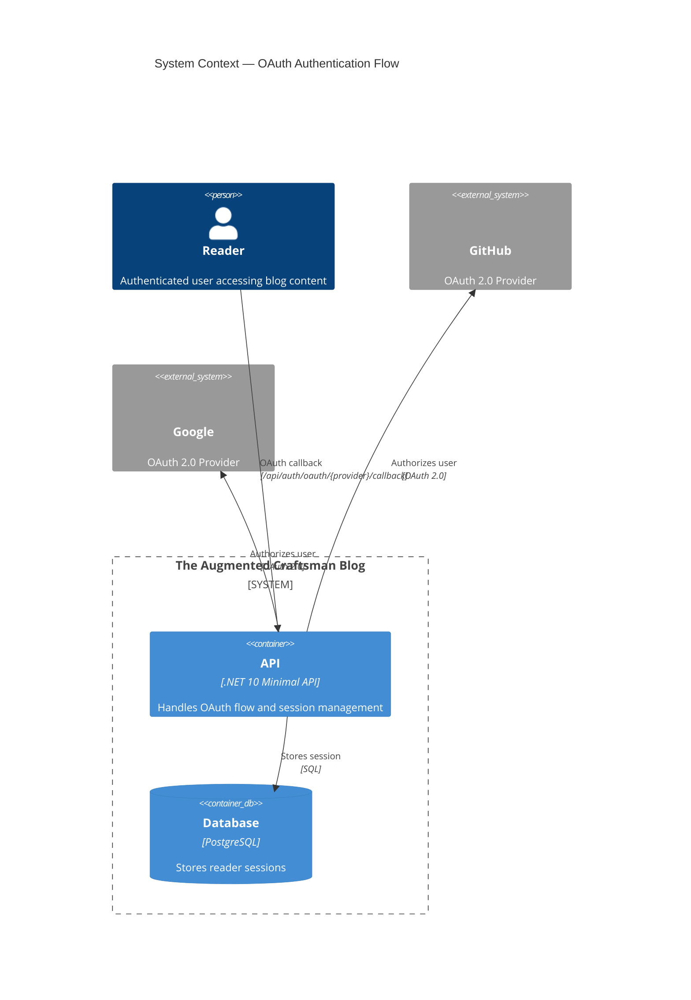
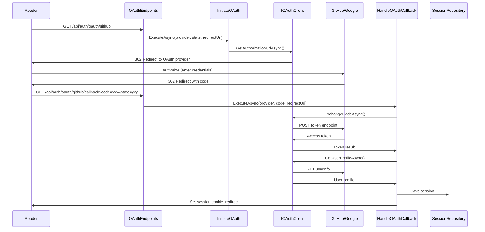

# OAuth Authentication - Architecture Design

## System Context



## Problem Analysis

### Root Causes Identified

| Issue | Location | Impact |
|-------|----------|--------|
| Empty string OAuth settings | `Program.cs:75-80` | GitHub client ID/secret are empty strings → API errors |
| Unhandled exceptions | `ProductionOAuthClient.cs:40,80` | ArgumentOutOfRangeException → HTTP 500 |
| Redirect URI mismatch | `OAuthEndpoints.cs:120-124` | Dynamic host causes URI mismatch with OAuth provider |

### Quality Attributes

- **Reliability**: Graceful error handling (400 instead of 500)
- **Maintainability**: Startup configuration validation with clear errors
- **Security**: Proper redirect URI validation for dev/prod environments
- **Observability**: Logging for validation failures and OAuth errors; metrics for OAuth login attempts (success/failure)

## Component Architecture

### Container Diagram

```mermaid
C4Container
  title Container Diagram — OAuth Authentication
  Person(reader, "Reader", "Authenticates via GitHub/Google")
  
  Container(api, "API", ".NET 10 Minimal API", "OAuth endpoints") {
    Container(oauth_endpoints, "OAuthEndpoints", "Driving Adapter", "HTTP handlers")
    Container(initiate_oauth, "InitiateOAuth", "Use Case", "Builds auth URL")
    Container(handle_callback, "HandleOAuthCallback", "Use Case", "Processes OAuth callback")
    Container(check_session, "CheckSession", "Use Case", "Validates session")
  }
  
  System_Ext(github, "GitHub", "OAuth 2.0")
  System_Ext(google, "Google", "OAuth 2.0")
  
  ContainerDb(postgres, "PostgreSQL", "Database", "Reader sessions")
  
  Rel(oauth_endpoints, initiate_oauth, "Delegates")
  Rel(oauth_endpoints, handle_callback, "Delegates")
  Rel(oauth_endpoints, check_session, "Delegates")
  Rel(initiate_oauth, oauth_client, "Uses port")
  Rel(handle_callback, oauth_client, "Uses port")
  Rel(handle_callback, session_repo, "Uses port")
  Rel(oauth_client, github, "HTTP calls")
  Rel(oauth_client, google, "HTTP calls")
  Rel(session_repo, postgres, "SQL")
```

### Component Diagram — OAuth Subsystem

```mermaid
C4Component
  title Component Diagram — OAuth Subsystem
  Container_Boundary(oauth_system, "OAuth Subsystem") {
    Component(initiate, "InitiateOAuth", "Use Case", "Creates authorization URL")
    Component(handle, "HandleOAuthCallback", "Use Case", "Processes callback, creates session")
    Component(check, "CheckSession", "Use Case", "Validates existing session")
    
    Component(oauth_port, "IOAuthClient", "Port", "Abstraction for OAuth providers")
    Component(session_port, "IReaderSessionRepository", "Port", "Abstraction for session storage")
  }
  
  Component(production_client, "ProductionOAuthClient", "Adapter", "Implements OAuth 2.0 flow")
  Component(dev_client, "DevOAuthClient", "Adapter", "Stub for testing")
  
  Component(oauth_settings, "OAuthSettings", "Value Object", "Configuration with validation")
  Component(oauth_validator, "OAuthSettingsValidator", "Component", "Validates config at startup")
  
  Rel(initiate, oauth_port, "Uses")
  Rel(handle, oauth_port, "Uses")
  Rel(handle, session_port, "Uses")
  Rel(check, session_port, "Uses")
  
  Rel(oauth_port, production_client, "Implemented by (prod)")
  Rel(oauth_port, dev_client, "Implemented by (dev)")
  
  Rel(api, oauth_validator, "Validates on startup")
  Rel(oauth_validator, oauth_settings, "Validates")
}
```

## Technology Stack

| Component | Technology | Rationale |
|-----------|------------|-----------|
| OAuth Client | ProductionOAuthClient (existing) | Already implements OAuth 2.0 flow |
| Configuration | OAuthSettings (existing) | Record-based, but needs validation |
| Validation | IHostEnvironment-based | Distinguishes dev/prod environments |
| Error Handling | Result objects (existing pattern) | Use existing `*Result` pattern |

## Integration Patterns

### OAuth Flow Sequence



## Component Boundaries

### New Components

| Component | Responsibility | Public API |
|-----------|---------------|------------|
| `OAuthSettingsValidator` | Validates OAuth settings at startup | `Validate()` → throws if invalid |
| `IOAuthClient` (enhance) | Add validation method | `ValidateConfiguration()` → `Result` |

### Modified Components

| Component | Change |
|-----------|--------|
| `OAuthSettings` | Add validation method, support nullable strings properly |
| `ProductionOAuthClient` | Return Result instead of throwing exceptions |
| `OAuthEndpoints` | Add configurable redirect URI base |
| `Program.cs` | Call validator at startup, handle validation errors |

### Responsibilities

- **OAuthSettingsValidator**: Validates that required OAuth credentials are present and non-empty. Throws detailed exception in production; warns in dev.
- **ProductionOAuthClient**: Returns graceful error results instead of throwing ArgumentOutOfRangeException. Validates configuration before operations.
- **OAuthEndpoints**: Uses configured base URL for redirect URIs instead of dynamic request host.

## Design Decisions

### ADR: OAuth Configuration Validation

```markdown
# ADR-001: OAuth Configuration Validation at Startup

## Status: Accepted

## Context
OAuth credentials come from environment variables. Currently, missing env vars result in empty strings, causing runtime errors (500) when OAuth is attempted.

## Decision
Validate OAuth settings at application startup and fail fast with clear error messages.

## Alternatives Considered

### 1. Validate on First Request (Lazy Validation)
Validate OAuth settings when the first OAuth request is received.

- **Rejected because**: Error only discovered on first use, making debugging harder. Users would encounter errors unexpectedly during normal usage.

### 2. Use IValidateOptions Pattern
Leverage ASP.NET Core's IValidateOptions for options validation.

- **Rejected because**: IValidateOptions is designed for options validation within the options pattern, not for startup orchestration. Doesn't provide clear fail-fast behavior for missing required configuration.

## Consequences
- Positive: Fast failure with actionable error message
- Positive: Prevents 500 errors for users
- Negative: Application won't start without valid OAuth config (intentional)
```

### ADR: Graceful Error Handling

```markdown
# ADR-002: Graceful OAuth Error Handling

## Status: Accepted

## Context
ProductionOAuthClient throws ArgumentOutOfRangeException for unknown providers, resulting in HTTP 500.

## Decision
IOAuthClient methods return Result objects instead of throwing exceptions. Unknown providers return a failure Result.

## Alternatives Considered

### 1. Exception Handling Middleware
Create custom middleware to catch exceptions and convert to appropriate HTTP responses.

- **Rejected because**: The codebase already uses Result objects consistently for error handling. Adding middleware would introduce a different pattern and make error handling inconsistent across the codebase.

### 2. Endpoint-Level Try-Catch
Wrap each endpoint call in try-catch blocks.

- **Rejected because**: Would require duplicating error handling across multiple endpoints (InitiateOAuth, HandleOAuthCallback, CheckSession). The Result pattern already exists in the application layer and should be leveraged.

## Consequences
- Positive: HTTP 400 instead of 500 for validation errors
- Positive: Consistent error handling pattern with existing use cases
- Negative: More Result types to maintain
```

### ADR: Redirect URI Configuration

```markdown
# ADR-003: Configurable Redirect URI Base

## Status: Accepted

## Context
Redirect URI is dynamically built from request.Host, which differs between development and production. OAuth providers require exact match.

## Decision
Add configuration option `OAuth:RedirectBaseUrl` that explicitly sets the base URL for redirect URIs. Default to request scheme + host for convenience, but allow override.

## Alternatives Considered

### 1. Environment-Based Conditional
Use different redirect URIs based on ASPNETCORE_ENVIRONMENT (Development vs Production).

- **Rejected because**: Doesn't handle staging, preview, or other environments. Hard-coded environment detection is less flexible than explicit configuration.

### 2. Auto-Detect with Override
Automatically detect the base URL from the request but allow explicit override.

- **Rejected because**: OAuth providers require the exact URI registered in the app. Auto-detection can lead to subtle bugs where local requests work but production fails. Explicit configuration is safer and more predictable.

## Consequences
- Positive: Explicit control over redirect URI
- Positive: Works across dev/staging/production
- Negative: Requires configuration in each environment
```

## Quality Validation

### Quality Gates

| Gate | Validation |
|------|------------|
| Requirements traced | R1→OAuthSettingsValidator, R2→Result pattern, R3→RedirectBaseUrl |
| Component boundaries | OAuthSettings validator isolated, errors propagate correctly |
| Technology choices | Uses existing patterns (Result objects, minimal API) |
| Integration patterns | OAuth 2.0 standard flow maintained |
| OSS preference | All existing OSS (.NET 10, PostgreSQL) |
| C4 diagrams | L1 (System Context), L2 (Container), L3 (Component) included |
| External integrations | GitHub/Google OAuth annotated for contract testing |

### External Integration Annotation

> **Contract Tests Recommended**: OAuth providers (GitHub, Google) are external integrations. While they don't support consumer-driven contracts directly, the OAuth flow is well-documented and stable. The implementation uses standard OAuth 2.0 which has predictable behavior.

## Recommended Implementation Order

1. **Phase 1**: OAuthSettings validation at startup
2. **Phase 2**: Graceful error handling in ProductionOAuthClient
3. **Phase 3**: Redirect URI configuration
4. **Phase 4**: Integration testing with real OAuth providers