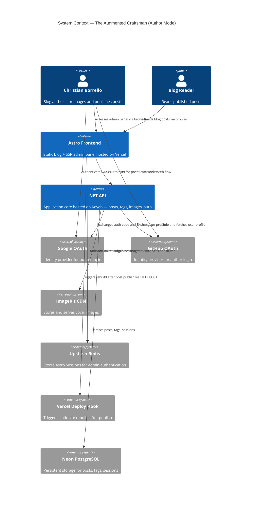
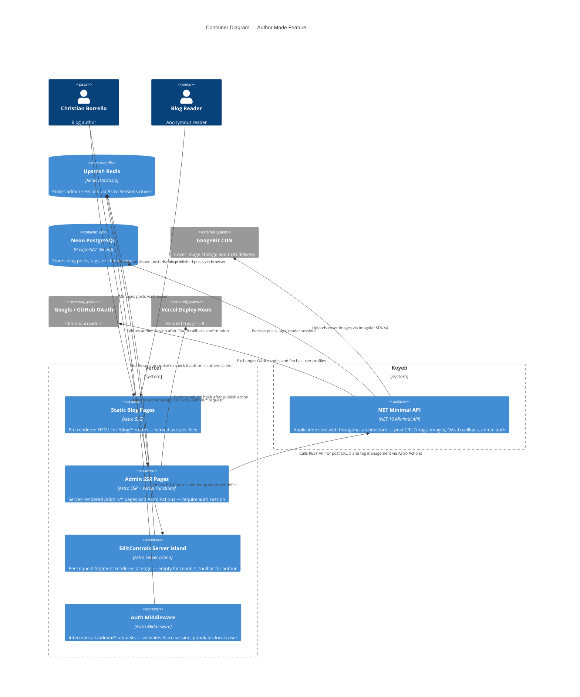
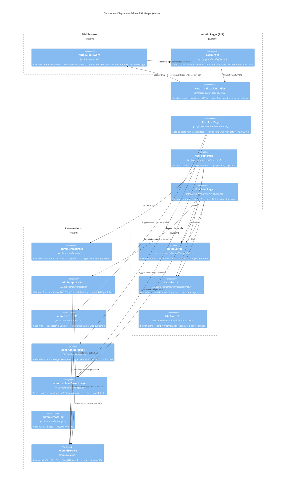

# Architecture Design: Author Mode

**Feature**: author-mode
**Wave**: DESIGN
**Date**: 2026-03-14
**Architect**: Morgan (solution-architect)

---

## 1. System Context

### 1.1 Prior Wave Artifacts Confirmed

- [x] `docs/feature/author-mode/discuss/wave-decisions.md`
- [x] `docs/feature/author-mode/discuss/requirements.md`
- [x] `docs/feature/author-mode/discuss/acceptance-criteria.md`
- [x] `docs/feature/author-mode/discuss/user-stories.md`
- [x] `docs/feature/author-mode/discuss/story-map.md`
- [x] `docs/feature/author-mode/discuss/outcome-kpis.md`
- [x] DISCOVER wave: no artifact exists at `docs/feature/author-mode/discover/wave-decisions.md`

### 1.2 Existing System Analysis

The codebase is significantly more built out than implied by the requirement description. Key findings:

**Backend (.NET 10 — Koyeb):**
- `OAuthEndpoints.cs` already implements `GET /api/auth/oauth/{provider}` and `GET /api/auth/oauth/{provider}/callback` for reader sessions (Google + GitHub). The callback creates a `ReaderSession` in PostgreSQL and sets a `reader_session` cookie.
- `PostEndpoints.cs` already exposes `GET /api/admin/posts`, `GET /api/admin/posts/{slug}` (protected by JWT `.RequireAuthorization()`), and `POST /api/posts`, `PUT /api/posts/{id}`, `POST /api/posts/{id}/publish`.
- `AuthEndpoints.cs` exposes `POST /api/auth/login` with email+password → JWT flow.
- `PostStatus` enum has `Draft` and `Published`. `Archived` does not yet exist and must be added.
- `HandleOAuthCallback` creates a `ReaderSession` — NOT an admin session. The admin whitelist check (`ADMIN_EMAIL`) does NOT yet exist.
- `EditPost`, `CreatePost`, `PublishPost`, `DeletePost`, `ListPosts` use cases all exist.
- `ImageKit` upload infrastructure exists (`IImageStorage`, `UploadImage`, `SetFeaturedImage`).
- `ListTags`, `CreateTag` use cases exist (`GET /api/tags`, `POST /api/tags`).

**Frontend (Astro 6.0.4 — Vercel):**
- `output: 'static'` — the entire site is currently static. Hybrid mode requires `output: 'hybrid'` or `output: 'server'` (with `prerender: true` default).
- `@astrojs/preact` with `compat: true` and Tiptap integration already validated.
- No existing `/admin/*` pages or middleware.
- Astro Sessions (Upstash Redis driver) not yet configured.
- `security.checkOrigin: true` already set in `astro.config.mjs`.

**Critical integration insight (resolves RC-01, RC-02):** The backend already has a working OAuth flow for readers. The admin flow REUSES this infrastructure with one addition: an `ADMIN_EMAIL` whitelist check in the callback. The frontend (Astro) does NOT use a JWT — it uses Astro Sessions (Upstash Redis). The bridge is a new dedicated backend endpoint `GET /api/auth/admin/session-token` (or inline in the callback redirect) that exchanges the backend's knowledge of "this OAuth user is admin" into a one-time token that Astro consumes to set its session. The detailed flow is specified in Section 3 below.

---

## 2. C4 Diagrams

### 2.1 System Context (L1)



### 2.2 Container Diagram (L2)



### 2.3 Component Diagram — Admin SSR Container (L3)

The Admin SSR container has sufficient complexity (5+ distinct internal components) to warrant L3.



---

## 3. OAuth Flow — RC-01 Resolution

**Red card RC-01 resolved** by specifying the complete HTTP flow.

### 3.1 Design Decision

The backend already has a working OAuth infrastructure for reader sessions (`HandleOAuthCallback`). The admin OAuth flow REUSES the same infrastructure but adds:

1. An `ADMIN_EMAIL` environment variable check in the backend callback handler.
2. A short-lived, single-use admin token issued by the backend to the Astro frontend upon successful admin authentication.
3. Astro consumes that token on a dedicated callback page and creates the Astro session in Upstash Redis.

This avoids duplicating OAuth client configuration and reuses the existing `IOAuthClient` / provider adapter.

### 3.2 Sequence Diagram

```
Author                    Astro (Vercel)             .NET Backend (Koyeb)         Google/GitHub
  |                           |                              |                          |
  |-- GET /admin/login ------>|                              |                          |
  |<-- login page (buttons) --|                              |                          |
  |                           |                              |                          |
  |-- click "Login w/ Google"-|                              |                          |
  |   GET /admin/login/google |                              |                          |
  |   (Astro page redirect)-->|                              |                          |
  |                           |-- Redirect 302 ------------->|                          |
  |                           |   GET /api/auth/admin/       |                          |
  |                           |   oauth/google               |                          |
  |                           |              |               |                          |
  |                           |              |-- Redirect 302 to Google OAuth ---------->|
  |<-- browser follows -------|--------------|               |                          |
  |                                                          |                          |
  |-- approves consent ----------------------------------------------------------------->|
  |<-- redirect to /api/auth/admin/oauth/google/callback?code=... -----------------------|
  |                           |              |               |                          |
  |                           |              |<-- code arrives at .NET backend           |
  |                           |              |-- exchange code for token --------------->|
  |                           |              |<-- access token --------------------------|
  |                           |              |-- GET user profile ---------------------->|
  |                           |              |<-- { email, name, avatar } --------------|
  |                           |              |                          |                |
  |                           |              |-- check email == ADMIN_EMAIL              |
  |                           |              |   [FAIL] -> Redirect to                   |
  |                           |              |   /admin/login?error=unauthorized          |
  |                           |              |   [PASS] -> generate short-lived          |
  |                           |              |   admin token (signed JWT, 5 min TTL,     |
  |                           |              |   single-use via Redis nonce)             |
  |                           |              |-- Redirect 302 to                         |
  |                           |              |   /admin/callback?token=<admin_token>     |
  |                           |              |   &email=<email>&name=<name>              |
  |<-- browser follows to Astro /admin/callback ----------------------------------------|
  |                           |                              |                          |
  |-- GET /admin/callback?token=... -->|                     |                          |
  |                           |-- POST /api/auth/admin/      |                          |
  |                           |   verify-token { token }  -->|                          |
  |                           |              |-- validate JWT signature + TTL            |
  |                           |              |-- invalidate nonce (single-use)           |
  |                           |              |<-- 200 { email, name, avatarUrl }         |
  |                           |-- session.set({ isAdmin: true, email, name }) to Redis  |
  |<-- Redirect 302 /admin/posts ---|         |                          |               |
```

### 3.3 New Backend Endpoints Required

The existing `/api/auth/oauth/{provider}` flow is for **readers** and creates `ReaderSession`. Two new admin-specific routes are needed:

| Endpoint | Method | Purpose |
|---|---|---|
| `/api/auth/admin/oauth/{provider}` | GET | Initiates OAuth flow with admin return URL |
| `/api/auth/admin/oauth/{provider}/callback` | GET | Handles callback — checks ADMIN_EMAIL — issues single-use admin token — redirects to Astro |
| `/api/auth/admin/verify-token` | POST | Astro calls this to exchange admin token for user data — invalidates token after one use |

### 3.4 Why Not Pass Data Directly in Redirect Query Params?

Passing email/name in plain redirect URL would expose them in browser history and server logs. The short-lived token pattern means sensitive data is validated server-to-server (Astro SSR function to .NET backend), not in the browser.

### 3.5 Why Not Reuse Reader Session Cookie?

Reader sessions use `reader_session` cookie containing a `Guid` backed by `ReaderSession` in PostgreSQL. Admin sessions use Astro Sessions in Upstash Redis with `isAdmin: true`. These are two separate authentication contexts with different lifetimes, different storage, and different trust levels. Mixing them would create confusion and security risks.

---

## 4. API Authorization — RC-02 Resolution

**Red card RC-02 resolved** by specifying double-layer authorization.

### 4.1 Backend Authorization Strategy

The `.NET` backend uses **JWT Bearer token** authentication for admin endpoints (`.RequireAuthorization()`). This exists today for the email+password login flow. The admin OAuth flow will use the SAME JWT mechanism.

When Astro calls the backend for admin operations (create/edit/publish/archive post), it must include a JWT `Authorization: Bearer <token>` header. The JWT is issued by `.NET` and stored in the Astro Session alongside the user profile.

**Flow after Astro session creation:**
1. `POST /api/auth/admin/verify-token` returns `{ email, name, avatarUrl, jwtToken, jwtExpiresAt }`.
2. Astro stores `jwtToken` in the Astro session.
3. Every Astro Action that calls the .NET API includes `Authorization: Bearer <jwtToken>` in the fetch request.
4. On JWT expiry (default 60 min), the Astro Action receives 401 — the middleware redirects to `/admin/login`.

### 4.2 Auth Layers

| Layer | What it checks | Where |
|---|---|---|
| Layer 1 — Astro Middleware | Astro session present + `isAdmin: true` | Every `/admin/*` request, before page/action handler |
| Layer 2 — Astro Action Handler | `Astro.locals.user` present before calling .NET API | Every Action, explicitly |
| Layer 3 — .NET API | JWT Bearer token valid + non-expired | Every `.RequireAuthorization()` endpoint |

This is true defense-in-depth. The .NET API is never exposed without a valid JWT, regardless of what Astro does.

### 4.3 `GET /api/admin/posts` — Access Control

This endpoint already exists (`ListAllPostsAsync` — `.RequireAuthorization()`). It is NOT publicly accessible. A valid JWT is required. The endpoint returns all posts including drafts and archived posts. Public readers use `GET /api/posts` which only returns `Published` posts. These are separate routes with separate authorization — no `?admin=true` query parameter pattern.

---

## 5. Session Handling — Server Islands vs. Astro Pages

**Ambiguity resolved**: The DISCUSS wave's `shared-artifacts-registry.md` uses `Astro.session` throughout, but US-07's technical notes specify `Astro.cookies` for the Server Island. This is the correct distinction:

| Context | Mechanism | Reason |
|---|---|---|
| Admin pages (`/admin/*`) | `Astro.session` | Full SSR context — session driver available |
| Astro Actions | `Astro.locals.user` (injected by middleware) | Middleware pre-populates |
| Server Island (`EditControls`) | `Astro.cookies` directly | Server Islands do not go through the standard middleware pipeline — they are independent request handlers. `Astro.session` may not be reliably available. Reading the session cookie value manually and checking against Redis is the safe pattern. |

The Server Island reads the Astro session cookie (whose name is configured by the Upstash driver, typically `astro-session`), looks up the session in Upstash Redis, and checks for `isAdmin: true`. If confirmed, it renders the toolbar. Otherwise, it returns an empty fragment.

---

## 6. Vercel Hybrid Mode Transition

### 6.1 Required Change

`astro.config.mjs` currently sets `output: 'static'`. Author Mode requires SSR for `/admin/*` pages. The required change is:

- `output: 'hybrid'` — keeps all existing `/blog/*` and public pages as SSG (prerendered), adds SSR capability for pages that opt out with `export const prerender = false`.

This is a non-breaking change for readers. All `/blog/*` pages remain fully static.

### 6.2 CI Guard

A CI check must verify that every file under `src/pages/admin/` contains `export const prerender = false`. A missing flag causes silent pre-rendering in production, bypassing the auth middleware. This is the highest-risk misconfiguration.

---

## 7. `PostStatus.Archived` — Domain Extension

The existing `PostStatus` enum has `Draft` and `Published`. `Archived` must be added. The domain also needs a `PreviousStatus` field on `BlogPost` to support restore (US-12).

### 7.1 Domain Changes Required

| Component | Change |
|---|---|
| `PostStatus` enum | Add `Archived` value |
| `BlogPost` aggregate | Add `PreviousStatus` property (nullable) — set when transitioning to Archived |
| `IBlogPostRepository` | Add `FindByIdAsync` and `FindAllAsync` (already exist) — no new ports needed |
| New use case: `ArchivePost` | Sets `status: Archived`, stores `PreviousStatus`, persists |
| New use case: `RestorePost` | Reads `PreviousStatus`, sets `status` back, triggers rebuild if published |
| `ListPosts` use case | Currently returns all posts — needs to filter by status for public API |
| `BrowsePublishedPosts` | Already filters — no change |
| New API endpoints | `PATCH /api/posts/{id}/archive`, `PATCH /api/posts/{id}/restore` |

### 7.2 Archived Post URL Behavior (RC-03 Resolution)

When a reader visits `/blog/{slug}` for an archived post:
- The SSG page no longer exists after rebuild (Vercel removes it).
- The .NET API returns 404 for archived posts at `GET /api/posts/{slug}` (same as draft).
- The Astro blog page (`/blog/[slug].astro`) handles the 404 from the API by returning Astro's native 404 page.
- No separate "Contenuto rimosso" page is required for MVP. A standard 404 is correct and simpler.

---

## 8. Vercel Rebuild Strategy (RC-04 Resolution)

### 8.1 How Vercel Deploy Hooks Work

A Vercel Deploy Hook is a webhook URL that triggers a full site rebuild. There is no ISR (Incremental Static Regeneration) available on the `@astrojs/vercel` static adapter — the entire site rebuilds. For a personal blog with a small number of posts, full rebuild is acceptable (typically 30-60 seconds).

### 8.2 Rebuild Trigger Points

| Action | Rebuild Required | Reason |
|---|---|---|
| Publish post (draft → published) | Yes | New static page must appear |
| Update published post | Yes | Existing static page must update |
| Archive published post | Yes | Static page must be removed (404) |
| Save/update draft | No | No public page affected |
| Archive draft | No | No public page affected |
| Restore to Published | Yes | Static page must reappear |
| Restore to Draft | No | No public page affected |

### 8.3 Rebuild Polling

The MVP uses timeout-based feedback (60 second polling with manual fallback link) rather than Vercel REST API polling. This avoids needing a Vercel API token and the additional complexity of the Deployments API. This matches US-11 AC exactly.

---

## 9. Integration Patterns

### 9.1 Astro Actions → .NET API

All admin write operations flow through **Astro Actions** (type-safe, progressively enhanced form handlers). Actions:
- Are server-side only (no client exposure).
- Check `Astro.locals.user` before any backend call.
- Include `Authorization: Bearer <jwt>` from the session.
- Return typed error responses for form preservation on failure.

### 9.2 Server Island → Upstash Redis

The `EditControls` Server Island reads the Astro session cookie directly from `Astro.cookies` and validates the session against Upstash Redis. It does NOT call the .NET API (no `post.id` auth check needed — it only checks if the current visitor is the admin). The `post.id` is passed as an encrypted Astro prop (native Astro prop encryption — props are signed and not readable from HTML).

### 9.3 Tag Autocomplete Pattern

Tags are loaded once on page load via a server-side fetch to `GET /api/tags` in the `.astro` page component. The result is passed as a prop to the `TagSelector` Preact island. New tag creation within the island calls `admin.createTag` Action — which returns the new tag immediately for UI update without a full page reload.

---

## 10. Quality Attribute Strategies

### 10.1 Security

| Threat | Mitigation |
|---|---|
| Unauthorized admin access | Three-layer auth: Astro session + Action guard + JWT Bearer |
| CSRF | `security.checkOrigin: true` in `astro.config.mjs` (already set) |
| Session fixation | New session created fresh after OAuth; old session not reused |
| Token replay | Admin token is single-use (nonce stored in Redis, invalidated on first use) |
| `post.id` exposure in DOM | Astro native prop encryption in Server Islands |
| `prerender=false` missing | CI grep check prevents silent bypass |
| Slug mutation after publish | Backend enforces immutability via domain logic (BR-04) |

### 10.2 Performance

| Concern | Strategy |
|---|---|
| Blog readers not affected | `/blog/*` pages remain pure SSG — no change |
| Server Island latency | Returns empty fragment for readers (< 10ms Redis lookup) — deferred with `server:defer` + empty fallback |
| Admin cold start | Vercel Functions have cold starts. Acceptable for single user (NFR-01) |
| Tiptap bundle | `client:only="preact"` — loaded only on admin pages, not on public blog |

### 10.3 Maintainability + Testability

| Concern | Strategy |
|---|---|
| TDD (Outside-In) | New backend use cases (`ArchivePost`, `RestorePost`, admin OAuth) follow existing patterns — tested at use case level with stubbed ports |
| Acceptance tests | Feature-level BDD scenarios target observable behavior (session creation, post status transitions) |
| CI safety | Grep check for `prerender = false` prevents auth bypass |
| Domain extension | `PostStatus.Archived` + `PreviousStatus` extend existing domain with minimal surface |

### 10.4 Reliability

| Concern | Strategy |
|---|---|
| Rebuild failure | Post is always saved before rebuild attempt. Rebuild failure is recoverable |
| Session expiry mid-edit | Form data is preserved via Astro Action error path. User re-authenticates and retries |
| Backend unreachable | Action returns typed error; form preserved client-side (NFR-03) |

---

## 11. S-03 Sizing Note

**DISCUSS reviewer concern S-03**: Tiptap form story is 3 days; Walking Skeleton S1-S6 may take 4-5 days.

Assessment: The Tiptap prototype is already validated in the project (`src/components/admin/test-editor.astro`). The Walking Skeleton complexity is driven by the OAuth flow (new admin endpoints) and Astro hybrid mode transition — not Tiptap itself. The Walking Skeleton should be treated as 4-5 days, with the US-01 OAuth flow as the highest-risk item (validate first, as documented in the DISCUSS risk register).

---

## 12. Handoff Summary

### 12.1 Red Cards Resolved

| RC | Resolution |
|---|---|
| RC-01 | OAuth callback uses a new `/api/auth/admin/oauth/*` flow with short-lived single-use admin token. Astro `/admin/callback` page calls `/api/auth/admin/verify-token` to exchange token for user data + JWT. Session created in Upstash Redis by Astro. |
| RC-02 | `.NET` admin endpoints use JWT Bearer `.RequireAuthorization()`. Astro Actions include `Authorization: Bearer` header from stored JWT. Three-layer auth (Middleware + Action guard + JWT). |
| Session ambiguity | `Astro.session` for admin pages and Actions. `Astro.cookies` + direct Redis lookup for Server Island. |
| RC-03 | Archived post URLs return native Astro 404. Full rebuild removes static page. |
| RC-04 | Full Vercel rebuild via Deploy Hook. No ISR. Timeout at 60s with manual link fallback. |

### 12.2 New Backend Work Required

1. Add `PostStatus.Archived` + `PreviousStatus` to domain.
2. Add `ArchivePost` and `RestorePost` use cases.
3. Add admin OAuth endpoints (`/api/auth/admin/oauth/*`, `/api/auth/admin/verify-token`).
4. Extend `ADMIN_EMAIL` check in admin OAuth callback.
5. Add `PATCH /api/posts/{id}/archive` and `PATCH /api/posts/{id}/restore` API endpoints.
6. Add cover image management to post CRUD (set/unset `FeaturedImageUrl` during create/edit).
7. `ListPosts` returns all statuses for admin; public endpoints already filter.

### 12.3 New Frontend Work Required

1. Change `output: 'static'` to `output: 'hybrid'` in `astro.config.mjs`.
2. Configure Astro Sessions with Upstash Redis driver.
3. Implement `src/middleware.ts` for `/admin/*` guard.
4. Implement all `/admin/*` pages (login, callback, posts list, new, edit).
5. Implement Astro Actions for all admin write operations.
6. Implement `EditControls` Server Island.
7. Implement `RebuildService` (POST to Deploy Hook + timeout).
8. CI check: grep for `prerender = false` in `src/pages/admin/**`.
