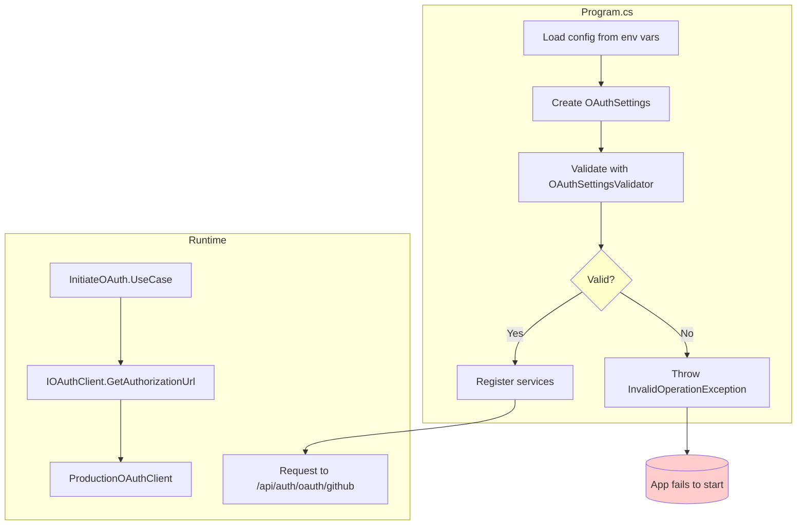

# OAuth Authentication - Component Boundaries

## Overview

This document defines the boundaries and responsibilities for OAuth authentication components after the proposed fixes.

## Component Responsibilities

### Domain Layer

| Component | Responsibility |
|-----------|---------------|
| `AuthProvider` (enum) | Enumerates supported OAuth providers: GitHub, Google |
| `ReaderSession` (entity) | Represents authenticated reader session with provider, display name, avatar, expiration |
| `OAuthUserProfile` (record) | DTO for OAuth provider user data |
| `OAuthTokenResult` (record) | Result wrapper for token exchange operations |

### Application Layer (Ports)

| Port | Responsibility | Location |
|------|---------------|----------|
| `IOAuthClient` | Abstract OAuth operations | `TacBlog.Application/Ports/Driven/IOAuthClient.cs` |
| `IReaderSessionRepository` | Abstract session persistence | `TacBlog.Application/Ports/Driven/IReaderSessionRepository.cs` |

### Application Layer (Use Cases)

| Use Case | Responsibility | Public API |
|----------|---------------|------------|
| `InitiateOAuth` | Creates authorization URL for provider | `ExecuteAsync(provider, state, redirectUri)` |
| `HandleOAuthCallback` | Exchanges code, creates session | `ExecuteAsync(provider, code, redirectUri)` |
| `CheckSession` | Validates session cookie | `ExecuteAsync(sessionId)` |
| `SignOut` | Deletes session | `ExecuteAsync(sessionId)` |

### Infrastructure Layer (Adapters)

| Adapter | Responsibility |
|---------|---------------|
| `ProductionOAuthClient` | Implements OAuth 2.0 with GitHub/Google |
| `DevOAuthClient` | Stub implementation for development |
| `EfReaderSessionRepository` | PostgreSQL session storage |
| `OAuthSettings` (Value Object) | OAuth configuration container |
| `OAuthSettingsValidator` (NEW) | Validates configuration at startup |

### Driving Adapter (API)

| Endpoint | Responsibility |
|----------|---------------|
| `OAuthEndpoints` | Maps HTTP requests to use cases, builds redirect URIs |

## New Component: OAuthSettingsValidator

```csharp
namespace TacBlog.Infrastructure.Identity;

public sealed class OAuthSettingsValidator
{
    private readonly OAuthSettings _settings;
    private readonly IHostEnvironment _environment;
    private readonly ILogger<OAuthSettingsValidator> _logger;

    public OAuthSettingsValidator(
        OAuthSettings settings,
        IHostEnvironment environment,
        ILogger<OAuthSettingsValidator> logger)
    {
        _settings = settings;
        _environment = environment;
        _logger = logger;
    }

    public void Validate()
    {
        // GitHub is required (primary OAuth provider)
        if (string.IsNullOrWhiteSpace(_settings.GitHubClientId))
        {
            _logger.LogError("OAuth validation failed: GitHub ClientId is missing. Application cannot start.");
            throw new InvalidOperationException(
                "OAuth:GitHub:ClientId is required. Set via environment variable.");
        }

        if (string.IsNullOrWhiteSpace(_settings.GitHubClientSecret))
        {
            _logger.LogError("OAuth validation failed: GitHub ClientSecret is missing. Application cannot start.");
            throw new InvalidOperationException(
                "OAuth:GitHub:ClientSecret is required. Set via environment variable.");
        }

        // Google is optional but warn if partial config
        var hasGoogleConfig = !string.IsNullOrWhiteSpace(_settings.GoogleClientId) &&
                             !string.IsNullOrWhiteSpace(_settings.GoogleClientSecret);

        var hasPartialGoogle = string.IsNullOrWhiteSpace(_settings.GoogleClientId) !=
                               string.IsNullOrWhiteSpace(_settings.GoogleClientSecret);

        if (hasPartialGoogle)
        {
            _logger.LogError("OAuth validation failed: Google OAuth has partial configuration (ClientId or ClientSecret missing).");
            throw new InvalidOperationException(
                "OAuth:Google requires both ClientId and ClientSecret, or neither.");
        }

        if (!hasGoogleConfig && _environment.IsProduction())
            _logger.LogWarning("Google OAuth not configured. Only GitHub login will be available.");
    }
}
```

## Modified Component: ProductionOAuthClient

Changes required:
1. Add `ValidateConfiguration()` method returning Result
2. Wrap exceptions in result objects instead of throwing

```csharp
public sealed class ProductionOAuthClient : IOAuthClient
{
    // Changed: return AuthorizationUrlResult (failure) instead of throwing
    public Task<AuthorizationUrlResult> GetAuthorizationUrlAsync(
        AuthProvider provider,
        string state,
        string redirectUri,
        CancellationToken cancellationToken = default)
    {
        if (provider != AuthProvider.GitHub && provider != AuthProvider.Google)
            return Task.FromResult(AuthorizationUrlResult.Failure("Provider not supported"));

        if (provider == AuthProvider.Google &&
            (string.IsNullOrEmpty(_settings.GoogleClientId) || string.IsNullOrEmpty(_settings.GoogleClientSecret)))
            return Task.FromResult(AuthorizationUrlResult.Failure("Google OAuth not configured"));

        // Build and return auth URL...
    }

    // Changed: return UserProfileResult (failure) instead of throwing
    public Task<UserProfileResult> GetUserProfileAsync(
        AuthProvider provider,
        string accessToken,
        CancellationToken cancellationToken = default)
    {
        if (provider != AuthProvider.GitHub && provider != AuthProvider.Google)
            return Task.FromResult(UserProfileResult.Failure("Provider not supported"));

        // Delegate to provider-specific implementation...
    }
}
```

## Modified Component: OAuthEndpoints

Changes required:
1. Use configured base URL for redirect URIs

```csharp
public static class OAuthEndpoints
{
    private const string SessionCookieName = "reader_session";
    private static string? _redirectBaseUrl; // Set via configuration
    
    public static void MapOAuthEndpoints(this WebApplication app)
    {
        // Get configured redirect base URL from app.Configuration
        _redirectBaseUrl = app.Configuration["OAuth:RedirectBaseUrl"];
        
        // Existing endpoint registration...
    }
    
    private static string BuildRedirectUri(HttpContext httpContext, string provider)
    {
        // Use configured base if available, otherwise fall back to request
        var baseUrl = _redirectBaseUrl ?? $"{httpContext.Request.Scheme}://{httpContext.Request.Host}";
        return $"{baseUrl}/api/auth/oauth/{provider}/callback";
    }
}
```

## Dependency Flow

```
┌─────────────────────────────────────────────────────────────┐
│                    Driving Adapter                          │
│  ┌─────────────────────────────────────────────────────┐   │
│  │  OAuthEndpoints                                     │   │
│  │  - Maps HTTP → Use Cases                            │   │
│  │  - Builds redirect URIs                             │   │
│  └─────────────────────────────────────────────────────┘   │
└─────────────────────────────────────────────────────────────┘
                           │
                           ▼
┌─────────────────────────────────────────────────────────────┐
│                   Application Core                          │
│  ┌─────────────┐  ┌─────────────┐  ┌─────────────────────┐ │
│  │InitiateOAuth│  │HandleOAuth  │  │   CheckSession      │ │
│  │             │  │ Callback    │  │                     │ │
│  └─────────────┘  └─────────────┘  └─────────────────────┘ │
│                           │                                 │
│  ┌─────────────────────────────────────────────────────┐   │
│  │  Ports (Interfaces)                                  │   │
│  │  - IOAuthClient                                     │   │
│  │  - IReaderSessionRepository                        │   │
│  └─────────────────────────────────────────────────────┘   │
└─────────────────────────────────────────────────────────────┘
                           │
                           ▼
┌─────────────────────────────────────────────────────────────┐
│                 Driven Adapters (Infrastructure)           │
│  ┌──────────────────┐  ┌───────────────────────────────┐   │
│  │ProductionOAuth  │  │   EfReaderSessionRepository   │   │
│  │Client            │  │                               │   │
│  └──────────────────┘  └───────────────────────────────┘   │
│  ┌──────────────────┐  ┌───────────────────────────────┐   │
│  │OAuthSettings     │  │   OAuthSettingsValidator    │   │
│  │(Value Object)    │  │   (NEW)                     │   │
│  └──────────────────┘  └───────────────────────────────┘   │
└─────────────────────────────────────────────────────────────┘
```

## Configuration Flow



## Testing Boundaries

| Test Type | What to Test | Mock/Stub |
|-----------|-------------|-----------|
| Unit | InitiateOAuth, HandleOAuthCallback | IOAuthClient stub |
| Integration | OAuthEndpoints | Real ProductionOAuthClient |
| Acceptance | Full OAuth flow | Real GitHub/Google + DevOAuthClient stub |

## Boundaries Summary

| Boundary | Rule |
|----------|------|
| Driving → Core | OAuthEndpoints only calls use case methods, never IOAuthClient directly |
| Core → Ports | Use cases depend on interfaces, not implementations |
| Ports → Adapters | ProductionOAuthClient implements IOAuthClient |
| Config → Runtime | Validation happens at startup, not per-request |
| Errors | Exceptions converted to Result objects at adapter boundary |