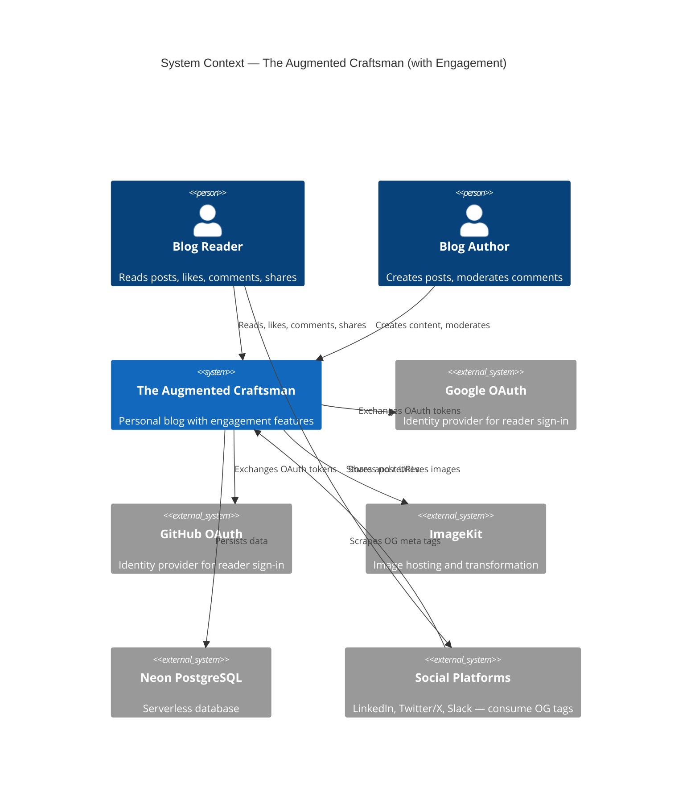
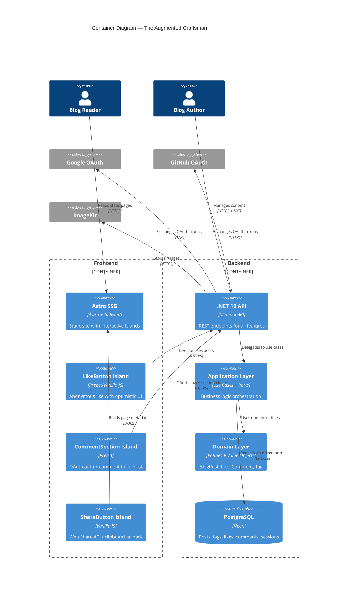

# Architecture Design -- Epic 5: User Engagement

## Architecture Overview

Epic 5 adds three engagement features (Likes, Comments, Sharing) to the existing blog platform. The architecture extends the existing hexagonal monolith without changing its fundamental structure.

**Key architectural decisions:**
- Like and Comment are independent entities in a new Engagement bounded context
- OAuth for readers is separate from admin JWT auth (two auth mechanisms coexist)
- Share is frontend-only (no backend component beyond OG meta tags)
- Reader sessions stored in PostgreSQL (same database, new table)
- No CQRS, no MediatR, no Domain Events (per existing project decisions)

---

## C4 System Context (L1)



---

## C4 Container (L2)



---

## C4 Component (L3) -- Engagement Subsystem

```mermaid
C4Component
    title Component Diagram — Engagement Features

    Container_Boundary(api_layer, "API Layer (Driving Adapter)") {
        Component(like_endpoints, "LikeEndpoints", "Minimal API", "POST/DELETE/GET like operations")
        Component(comment_endpoints, "CommentEndpoints", "Minimal API", "POST/DELETE/GET comment operations")
        Component(oauth_endpoints, "OAuthEndpoints", "Minimal API", "OAuth flow + session management")
        Component(admin_comment_ep, "AdminCommentEndpoints", "Minimal API", "Admin moderation endpoints")
    }

    Container_Boundary(app_layer, "Application Layer (Use Cases + Ports)") {
        Component(like_post, "LikePost", "Use Case", "Records a like for a post")
        Component(unlike_post, "UnlikePost", "Use Case", "Removes a like")
        Component(get_like_count, "GetLikeCount", "Use Case", "Returns like count")
        Component(check_liked, "CheckIfLiked", "Use Case", "Checks visitor like status")
        Component(create_comment, "CreateComment", "Use Case", "Creates a sanitized comment")
        Component(delete_comment, "DeleteComment", "Use Case", "Admin deletes a comment")
        Component(get_comments, "GetCommentsByPost", "Use Case", "Lists comments for a post")
        Component(get_comment_count, "GetCommentCount", "Use Case", "Returns comment count")
        Component(list_all_comments, "ListAllComments", "Use Case", "Admin lists all comments")
        Component(handle_oauth, "HandleOAuthCallback", "Use Case", "Processes OAuth callback")
        Component(check_session, "CheckSession", "Use Case", "Validates reader session")
        Component(sign_out, "SignOut", "Use Case", "Clears reader session")

        Component(like_port, "ILikeRepository", "Driven Port", "Like persistence contract")
        Component(comment_port, "ICommentRepository", "Driven Port", "Comment persistence contract")
        Component(session_port, "IReaderSessionRepository", "Driven Port", "Session persistence contract")
        Component(oauth_port, "IOAuthClient", "Driven Port", "OAuth provider communication")
        Component(sanitizer_port, "ITextSanitizer", "Driven Port", "HTML/XSS sanitization")
    }

    Container_Boundary(infra_layer, "Infrastructure Layer (Driven Adapters)") {
        Component(ef_like_repo, "EfLikeRepository", "EF Core", "PostgreSQL like persistence")
        Component(ef_comment_repo, "EfCommentRepository", "EF Core", "PostgreSQL comment persistence")
        Component(ef_session_repo, "EfReaderSessionRepository", "EF Core", "PostgreSQL session persistence")
        Component(google_oauth, "GoogleOAuthClient", "HttpClient", "Google OAuth API integration")
        Component(github_oauth, "GitHubOAuthClient", "HttpClient", "GitHub OAuth API integration")
        Component(html_sanitizer, "HtmlSanitizer", "Ganss.Xss.HtmlSanitizer", "XSS prevention")
    }

    Rel(like_endpoints, like_post, "Delegates to")
    Rel(like_endpoints, unlike_post, "Delegates to")
    Rel(like_endpoints, get_like_count, "Delegates to")
    Rel(like_endpoints, check_liked, "Delegates to")
    Rel(comment_endpoints, create_comment, "Delegates to")
    Rel(comment_endpoints, get_comments, "Delegates to")
    Rel(comment_endpoints, get_comment_count, "Delegates to")
    Rel(admin_comment_ep, delete_comment, "Delegates to")
    Rel(admin_comment_ep, list_all_comments, "Delegates to")
    Rel(oauth_endpoints, handle_oauth, "Delegates to")
    Rel(oauth_endpoints, check_session, "Delegates to")
    Rel(oauth_endpoints, sign_out, "Delegates to")

    Rel(like_post, like_port, "Uses")
    Rel(create_comment, comment_port, "Uses")
    Rel(create_comment, sanitizer_port, "Uses")
    Rel(handle_oauth, oauth_port, "Uses")
    Rel(handle_oauth, session_port, "Uses")
    Rel(check_session, session_port, "Uses")

    Rel(like_port, ef_like_repo, "Implemented by")
    Rel(comment_port, ef_comment_repo, "Implemented by")
    Rel(session_port, ef_session_repo, "Implemented by")
    Rel(oauth_port, google_oauth, "Implemented by")
    Rel(oauth_port, github_oauth, "Implemented by")
    Rel(sanitizer_port, html_sanitizer, "Implemented by")
```



---

## Component Architecture

### Domain Layer (`TacBlog.Domain`)

New entities and value objects in the Engagement bounded context:

| Component | Type | Responsibility |
|-----------|------|----------------|
| Like | Entity | Immutable fact: visitor liked a post |
| Comment | Entity | Reader comment on a post |
| VisitorId | Value Object | Wraps anonymous UUID |
| CommentId | Value Object | Wraps comment GUID |
| CommentText | Value Object | Validated comment body (1..2000 chars) |
| DisplayName | Value Object | OAuth display name |
| AvatarUrl | Value Object | OAuth avatar URL |
| AuthProvider | Enum | Google or GitHub |

See `domain-model.md` for full specifications.

### BlogPost Aggregate Boundary Constraints

- `BlogPost.Tags` is the ONLY child collection on BlogPost
- BlogPost must NOT have a `Comments` or `Likes` property or child collection
- Comment and Like must be queried separately via `ICommentRepository` and `ILikeRepository` (independent entities)
- Rationale: BlogPost bounded sizing, independent engagement lifecycle, query performance

### Application Layer (`TacBlog.Application`)

Vertical slice use cases following existing pattern (e.g., `CreatePost`, `DeletePost`):

**Likes feature (`Features/Likes/`):**
- `LikePost` -- records like, idempotent, validates slug exists
- `UnlikePost` -- removes like, idempotent
- `GetLikeCount` -- returns count for a post
- `CheckIfLiked` -- checks if visitor liked a post

**Comments feature (`Features/Comments/`):**
- `CreateComment` -- validates text, sanitizes, persists
- `DeleteComment` -- admin moderation, validates exists
- `GetCommentsByPost` -- chronological list
- `GetCommentCount` -- count for a post
- `ListAllComments` -- admin view, all posts, newest first

**Auth feature (extends `Features/Auth/`):**
- `HandleOAuthCallback` -- exchanges code for token, extracts profile, creates session
- `CheckSession` -- validates session cookie
- `SignOut` -- deletes session

**Driven ports (`Ports/Driven/`):**
- `ILikeRepository` -- like persistence
- `ICommentRepository` -- comment persistence
- `IReaderSessionRepository` -- session persistence
- `IOAuthClient` -- OAuth provider communication (token exchange + profile fetch)
- `ITextSanitizer` -- HTML sanitization

### Infrastructure Layer (`TacBlog.Infrastructure`)

**Persistence (`Persistence/`):**
- `EfLikeRepository` -- implements ILikeRepository via EF Core
- `EfCommentRepository` -- implements ICommentRepository via EF Core
- `EfReaderSessionRepository` -- implements IReaderSessionRepository via EF Core
- `LikeConfiguration` -- EF Core entity configuration
- `CommentConfiguration` -- EF Core entity configuration
- `ReaderSessionConfiguration` -- EF Core entity configuration

**OAuth (`OAuth/`):**
- `GoogleOAuthClient` -- Google token exchange + profile API
- `GitHubOAuthClient` -- GitHub token exchange + profile API
- `OAuthSettings` -- settings record for client IDs and secrets

**Sanitization (`Sanitization/`):**
- `HtmlSanitizerAdapter` -- wraps Ganss.Xss.HtmlSanitizer library

### API Layer (`TacBlog.Api`)

**Endpoints (`Endpoints/`):**
- `LikeEndpoints` -- maps like routes (AllowAnonymous)
- `CommentEndpoints` -- maps comment routes (mixed auth)
- `OAuthEndpoints` -- maps OAuth routes (AllowAnonymous)

See `api-contracts.md` for full endpoint specifications.

---

## Technology Stack

| Component | Technology | License | Rationale |
|-----------|-----------|---------|-----------|
| OAuth HTTP calls | `System.Net.Http.HttpClient` | MIT (.NET) | Built-in, no extra dependency |
| HTML sanitization | `HtmlSanitizer` (Ganss.Xss) | MIT | Well-maintained OSS, .NET native, prevents XSS |
| Frontend islands | Preact | MIT | 3KB, compatible with Astro Islands |
| Astro integration | `@astrojs/preact` | MIT | Official Astro integration |
| Rate limiting | `System.Threading.RateLimiting` | MIT (.NET) | Built-in .NET 10, no extra dependency |
| Session cookies | ASP.NET Core middleware | MIT (.NET) | Built-in cookie handling |

**No new paid services.** Google OAuth and GitHub OAuth are free. All other technologies are OSS (MIT).

---

## Integration Patterns

### Authentication Coexistence

Two independent auth mechanisms:

1. **Admin JWT** (existing): `Authorization: Bearer {token}` header. Used for post management and comment moderation.
2. **Reader session cookie** (new): `httpOnly` cookie with session ID. Used for comment posting.

These are separate authentication schemes in ASP.NET Core. Endpoints specify which scheme they require:
- `RequireAuthorization()` -- admin JWT (existing)
- Custom policy or middleware for reader session cookie (new)

### OAuth Flow

```
Reader                  Frontend           Backend            OAuth Provider
  |                        |                  |                     |
  |--- click sign in ----->|                  |                     |
  |                        |--- redirect ---->|                     |
  |                        |                  |--- redirect ------->|
  |<------ redirect to consent screen --------|                     |
  |--- grant consent ----->|                  |                     |
  |                        |                  |<-- code + state ----|
  |                        |                  |--- exchange code -->|
  |                        |                  |<-- access token ----|
  |                        |                  |--- fetch profile -->|
  |                        |                  |<-- name, avatar ----|
  |                        |                  |--- create session --|
  |<-- redirect + cookie --|                  |                     |
```

### Rate Limiting

Implemented as endpoint-level rate limiting policies using `System.Threading.RateLimiting` (built-in .NET 10):

**Like Rate Limiter:**
- Policy name: `like-limiter`
- Key: `visitor_id` extracted from request body (JSON property `visitorId`)
- Algorithm: fixed window, 5 requests per 10 seconds
- Behavior on excess: 6th request in window returns 200 with current count (idempotent, silent — no 429)
- Persistence: in-memory only (acceptable — rate limit resets on restart)
- Decision latency: < 1ms (in-memory evaluation)

**Comment Rate Limiter:**
- Policy name: `comment-limiter`
- Key: `session_id` extracted from httpOnly cookie
- Algorithm: fixed window, 5 requests per 10 minutes
- Behavior on excess: 6th request returns 429 with error message
- Persistence: in-memory for v1 (database-backed optional for future multi-instance)
- Decision latency: < 1ms (in-memory evaluation)

**Integration point:** Rate limiting policies applied via `.RequireRateLimiting("like-limiter")` on endpoint groups in `LikeEndpoints` and `CommentEndpoints`. Not global middleware — scoped to specific endpoints.

---

## Security Considerations

### STRIDE Analysis

| Threat | Component | Mitigation |
|--------|-----------|------------|
| **Spoofing** | Like endpoint | Accepted: anonymous likes, visitor_id is client-generated. Deduplication is best-effort. |
| **Spoofing** | Comment endpoint | OAuth + httpOnly session cookie. Tokens never exposed to client JS. |
| **Tampering** | Comment text | Server-side HTML sanitization (HtmlSanitizer). Input validation (CommentText VO). |
| **Repudiation** | Comment posting | Provider + display_name stored with comment. Session linked to OAuth identity. |
| **Info Disclosure** | OAuth flow | Tokens exchanged server-side only. No email stored. Minimal profile data. |
| **DoS** | Like/Comment APIs | Rate limiting per visitor/session. Query indexes for performance. |
| **Elevation of Privilege** | Comment moderation | Admin JWT required for DELETE. Reader cookie cannot access admin endpoints. |

### CSRF Protection

- Session cookie: `SameSite=Lax` prevents CSRF for POST endpoints from cross-origin
- Additional origin validation on comment POST if needed
- Like endpoint is idempotent and anonymous -- CSRF is low risk

### XSS Prevention

- Comment text sanitized server-side before persistence (Ganss.Xss.HtmlSanitizer)
- Frontend renders sanitized text safely -- no raw unsanitized user input rendered as HTML
- Output encoding in API responses (JSON serialization handles escaping)

---

## Cross-Cutting Concerns

### Error Handling

Follow existing pattern: use case returns result object with success/failure state. API layer maps to HTTP status codes. No exceptions for business logic flow.

### Logging

Serilog already configured. Add structured logging for:
- OAuth flow events (success, failure, provider errors)
- Comment moderation actions (admin deletes)
- Rate limiting triggers

### Configuration

New environment variables:
- `Google__ClientId`, `Google__ClientSecret`
- `GitHub__ClientId`, `GitHub__ClientSecret`
- `Session__Secret` (for session cookie encryption)
- `Session__ExpiryInDays` (default: 30)

---

## ADRs

### ADR-E01: Comment as Independent Entity

**Status:** Accepted

**Context:** Comments could be modeled as children of BlogPost aggregate or as independent entities. BlogPost currently owns Tags (small, bounded collection).

**Decision:** Comment is an independent entity referencing BlogPost by slug. Not a child of BlogPost aggregate.

**Alternatives Considered:**
- *Comment as BlogPost child:* Would grow the aggregate unboundedly. Loading a post would load all comments. Violates aggregate sizing guidance. Rejected: scalability and performance concerns.
- *Separate Comment aggregate with own ID:* This is the chosen approach. Independent lifecycle, queried separately, deleted independently.

**Consequences:**
- Positive: BlogPost stays small. Comments queried independently. No N+1 loading.
- Negative: No transactional consistency between post and its comments (acceptable -- they have different consistency needs).

---

### ADR-E02: Database-Backed Reader Sessions

**Status:** Accepted

**Context:** OAuth reader sessions need to persist across server restarts and work in multi-instance deployments. Options: in-memory, database, Redis.

**Decision:** Database-backed sessions in PostgreSQL (same Neon instance).

**Alternatives Considered:**
- *In-memory sessions:* Lost on restart. Not viable for production deployment on Fly.io (single instance but restarts happen). Rejected.
- *Redis:* Excellent for sessions but adds infrastructure cost and complexity. No free tier that meets needs without self-hosting. Rejected: violates budget constraint.
- *JWT for readers:* Stateless but cannot be revoked on sign-out. Contains user data that should stay server-side. Rejected.

**Consequences:**
- Positive: Persistent, revocable, no additional infrastructure cost.
- Negative: Slight latency for session lookup on every authenticated request (mitigated by PK index).

---

### ADR-E03: Dual Authentication Schemes

**Status:** Accepted

**Context:** Admin uses JWT (existing). Readers need OAuth sessions. Two different auth mechanisms must coexist.

**Decision:** Two ASP.NET Core authentication schemes: existing JWT Bearer for admin, custom cookie-based for reader sessions.

**Alternatives Considered:**
- *Unified OAuth for both admin and readers:* Would require the admin to use Google/GitHub too. Breaks existing admin flow. Rejected: unnecessary breaking change.
- *JWT for readers too:* Would expose reader identity in client-accessible token. Cannot revoke on sign-out. Rejected: security concern.

**Consequences:**
- Positive: Each auth mechanism optimized for its use case. No breaking changes.
- Negative: Two auth schemes add middleware complexity. Endpoints must specify which scheme.

**Implementation Detail:** Use a custom `IAuthenticationHandler` for reader session cookie validation, NOT ASP.NET Core session middleware. This allows:
- Unit testing of session validation without middleware pipeline
- Explicit session lookup from `IReaderSessionRepository` (driven port)
- Testable dependency injection — the handler depends on a port, not on infrastructure

---

### ADR-E04: HTML Sanitization Library

**Status:** Accepted

**Context:** Comment text must be sanitized to prevent XSS. Options: custom sanitization, library.

**Decision:** Use `Ganss.Xss.HtmlSanitizer` (MIT license, actively maintained).

**Alternatives Considered:**
- *Custom regex-based stripping:* Error-prone, hard to maintain, likely to miss edge cases. Rejected: security risk.
- *AntiXSS (Microsoft):* Archived, no longer maintained. Rejected.

**Consequences:**
- Positive: Battle-tested XSS prevention. Configurable allowlists. MIT license.
- Negative: Additional NuGet dependency (~100KB).

---

### ADR-E05: Like Deduplication Strategy

**Status:** Accepted

**Context:** Likes are anonymous (no auth). Deduplication needs a visitor identity. Options: IP-based, cookie-based, localStorage UUID.

**Decision:** Client-generated UUID (`visitor_id`) stored in localStorage. Server enforces uniqueness via composite key (post_slug, visitor_id).

**Alternatives Considered:**
- *IP-based:* Multiple users behind NAT would be treated as one. Proxies change IPs. Rejected: unreliable and privacy-invasive.
- *Server-generated cookie:* Would require server round-trip before first like. More complex. Rejected: unnecessary complexity for an anonymous feature.

**Consequences:**
- Positive: Simple, privacy-friendly, no server state for identity.
- Negative: Clearing localStorage allows re-liking (accepted trade-off per requirements BR-E01).

---

## Quality Attribute Strategies

| Quality Attribute | Strategy |
|-------------------|----------|
| **Performance** | Optimistic UI for likes. Lazy island hydration (`client:visible`). Database indexes on query paths. Rate limiter evaluation < 1ms (in-memory). |
| **Security** | OAuth tokens server-side only. httpOnly cookies. XSS sanitization. Rate limiting. CSRF via SameSite. |
| **Reliability** | Idempotent like operations. Draft preservation on failure. Graceful degradation without JS. |
| **Maintainability** | Vertical slice use cases. Ports and adapters. Independent entity boundaries. |
| **Testability** | All driven ports mockable. Use cases testable in isolation. Domain entities have no infrastructure dependencies. |
| **Privacy** | No email stored. Anonymous likes. Minimal OAuth profile data. No third-party tracking. |

---

## Deployment Architecture

No changes to deployment topology:
- Frontend: Vercel (static, unchanged)
- Backend: Fly.io (single .NET container, unchanged)
- Database: Neon PostgreSQL (additional tables via migration)

New configuration needed on Fly.io:
- Google OAuth credentials (secrets)
- GitHub OAuth credentials (secrets)
- Session encryption key (secret)

OAuth redirect URIs must be configured for both development (`localhost`) and production (`theaugmentedcraftsman.christianborrello.dev`).
